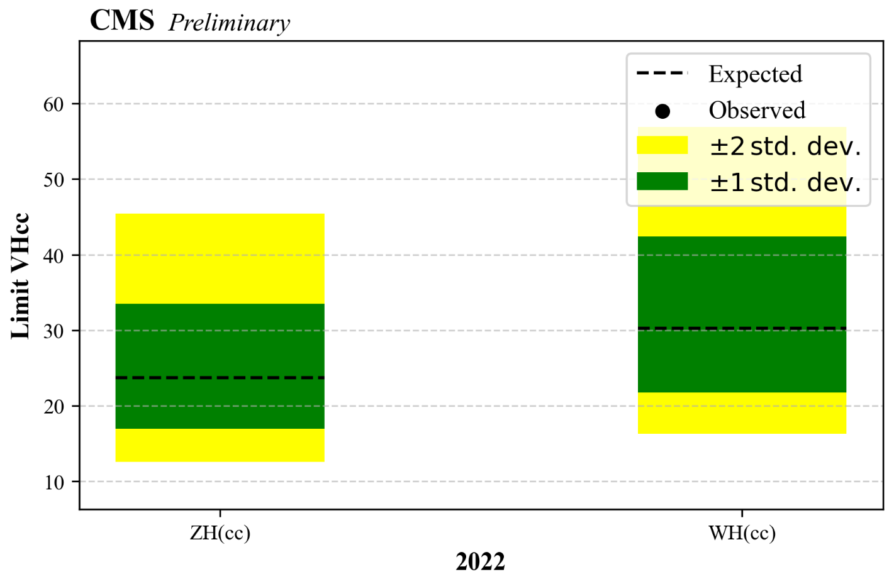
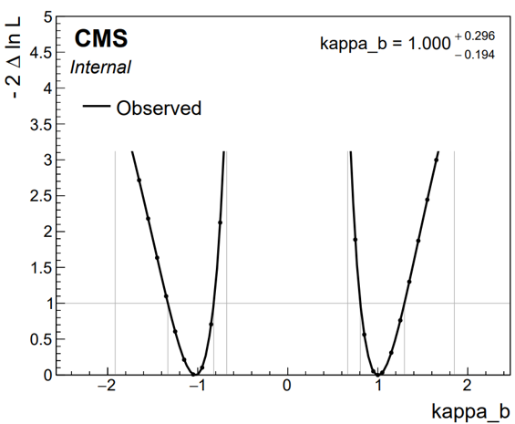
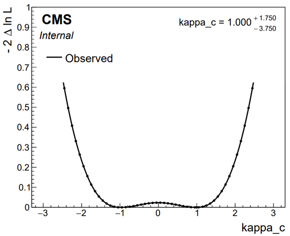
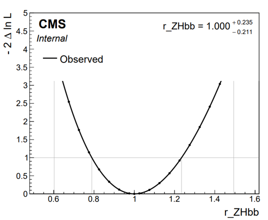
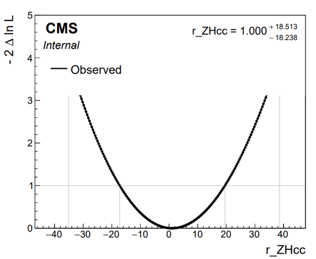
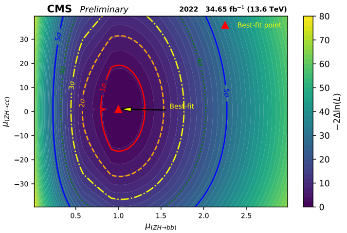
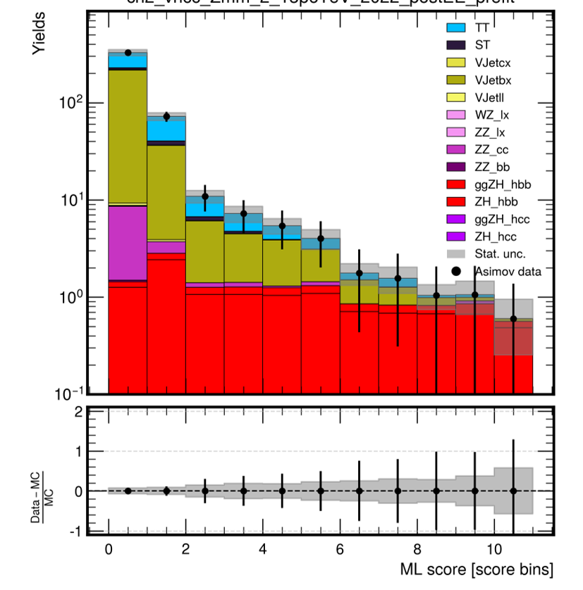
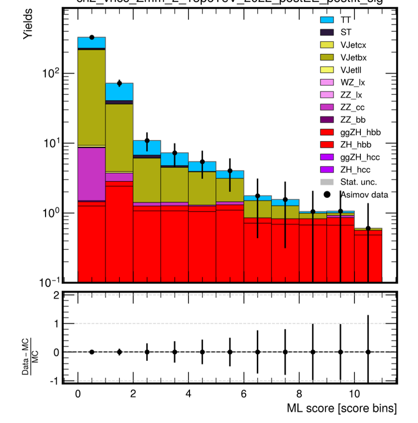
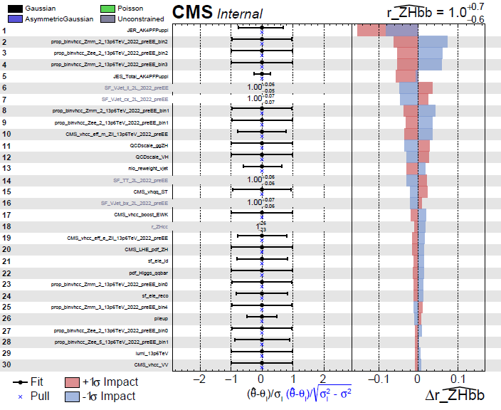

# VHcc Combine Harvest

Here one can find some scripts used to produce the datacards for VHcc analysis.  
We use CombineHarvester package for this job, therefore one has to first install `Combine` and `CombineHarvester` packages.

## Getting started

1. Setup your [Combine](http://cms-analysis.github.io/HiggsAnalysis-CombinedLimit/latest/) package:  
```
cmsrel CMSSW_14_1_0_pre4
cd CMSSW_14_1_0_pre4/src
cmsenv
git -c advice.detachedHead=false clone --depth 1 --branch v10.3.1 https://github.com/cms-analysis/HiggsAnalysis-CombinedLimit.git HiggsAnalysis/CombinedLimit
cd HiggsAnalysis/CombinedLimit
scramv1 b clean; scramv1 b -j$(nproc --ignore=2) # always make a clean build, with n - 2 cores on the system
```  
**Note** that the above tag was the recommended at the time of writing this (Nov-10, 2025). Check if a newer tag is recommended before proceeding.

Be patient, this compiling step might take some time.


2. Setup the [CombineHarvester](http://cms-analysis.github.io/CombineHarvester/) package:  
```
cmsrel CMSSW_14_1_0_pre4
cd CMSSW_14_1_0_pre4/src
cmsenv
git clone https://github.com/cms-analysis/HiggsAnalysis-CombinedLimit.git HiggsAnalysis/CombinedLimit
# IMPORTANT: Checkout the recommended tag on the link above
git clone https://github.com/cms-analysis/CombineHarvester.git CombineHarvester
cd CombineHarvester
git checkout v3.0.0
scram b
```  
**Note**: same as for Combine, check out the latest recommended tag. 

This step also need some time if scraming without multi-thread, but try to use the default setting to avoid errors.

3. Now, get *this* repository under your `CombineHarvester` directory:
```
cd CombineHarvester
git clone ssh://git@gitlab.cern.ch:7999/cms-analysis/hig/vhcc-run3/VHccCoHa.git
scram b
```

4. Get the input file with shapes from running the analysis code.

**Note** The following steps 5 to 7 is the VHcc fit workflow, for simultatious fit, please check the steps under `VHqq workflow` in this Readme.

5. Run the script:
```
python3 scripts/vhcc_cards.py -c Zll -y 2022_preEE
```  

The datacards and root file with re-arranged shapes should appear under `output` directory.

6. Create Combine workspace from the datacards:
```
ulimit -s unlimited
combineTool.py -M T2W --cc combined.txt -o ws.root -i output/vhcc_Run3_2022_preEE/cmb/*.txt
```  

7. Run the limit:
```
combineTool.py -M AsymptoticLimits -d ws.root --there --run blind
```  

* All-in-one command:
```console
for ch in Zll Wln; do for era in 2022_preEE 2022_postEE 2023_preBPix 2023_postBPix; do echo $ch $era; python3 scripts/vhcc_cards.py -c $ch -y $era; combineTool.py -M T2W --cc combined_${ch}_${era}.txt -o ws_${ch}_${era}.root -i output/vhcc_Run3_$era/cmb_$ch/*.txt; combineTool.py -M AsymptoticLimits -d ws_${ch}_${era}.root --there --run blind > output/limits_${ch}_${era}.log; done; done
```

## VHqq workflow

5. Run the script:
```
python3 scripts/vhqq_cards.py -c all -y 2022_postEE
```

### Setting up workspaces
**Note**: from this point on make sure to have called `ulimit -s unlimited` in your shell since logging in. Otherwise any of these manipulations might lead to a seg fault

#### Common usage

1. Combine datacards:
This is just an example, the eras and e/mu channels should be separated or combined accordingly.
```
export CARD=./output_Hcc_tst/vhqq_Run3_2022_postEE/ # modify

combineCards.py $CARD/vhcc_Zee_1_13p6TeV_2022_postEE.txt $CARD/vhcc_Zee_2_13p6TeV_2022_postEE.txt $CARD/vhcc_Zmm_1_13p6TeV_2022_postEE.txt $CARD/vhcc_Zmm_2_13p6TeV_2022_postEE.txt > $CARD/signal_regions.txt

combineCards.py $CARD/vhcc_Zee_3_13p6TeV_2022_postEE.txt $CARD/vhcc_Zee_4_13p6TeV_2022_postEE.txt $CARD/vhcc_Zee_5_13p6TeV_2022_postEE.txt $CARD/vhcc_Zee_7_13p6TeV_2022_postEE.txt $CARD/vhcc_Zee_8_13p6TeV_2022_postEE.txt $CARD/vhcc_Zee_9_13p6TeV_2022_postEE.txt $CARD/vhcc_Zee_3_13p6TeV_2022_postEE.txt $CARD/vhcc_Zee_4_13p6TeV_2022_postEE.txt $CARD/vhcc_Zee_5_13p6TeV_2022_postEE.txt $CARD/vhcc_Zee_7_13p6TeV_2022_postEE.txt $CARD/vhcc_Zee_8_13p6TeV_2022_postEE.txt $CARD/vhcc_Zee_9_13p6TeV_2022_postEE.txt > $CARD/control_regions.txt

cd $CARD

combineCards.py signal=signal_regions.txt control=control_regions.txt > combined_mask.txt

cd -
# careful about the direction of combined_mask.txt
```

**without mask**: combine cards without separating regions.

2. Build the workspace:
```
text2workspace.py $CARD/combined_mask.txt -o $CARD/ws_combined_masked_fit.root -P HiggsAnalysis.CombinedLimit.PhysicsModel:multiSignalModel --PO verbose --PO 'map=.*/ZH_hbb:r_ZHbb[1,-20,20]' --PO 'map=.*/ggZH_hbb:r_ZHbb[1,-20,20]' --PO 'map=.*/ZH_hcc:r_ZHcc[1,-400,400]' --PO 'map=.*/ggZH_hcc:r_ZHcc[1,-400,400]' # --channel-masks # optional channel masks
```

3. Upperlimit:
```
combineTool.py -M AsymptoticLimits -d $CARD/ws_combined_masked_fit.root --there --run blind --cminDefaultMinimizerStrategy 0 --redefineSignalPOIs r_ZHcc -n .limit.Hcc &

combineTool.py -M AsymptoticLimits -d $CARD/ws_combined_masked_fit.root --there --run blind --cminDefaultMinimizerStrategy 0 --redefineSignalPOIs r_ZHbb -n .limit.Hbb &
```

**visualization:**

```
combineTool.py -M CollectLimits $CARD/*.limit.Hbb* --use-dirs -o limits.Hbb.json

combineTool.py -M CollectLimits $CARD/*.limit.Hcc* --use-dirs -o limits.Hcc.json
```

Then optionally use the notebook `combinePlot_Era` (or any self-written script) to plot the limits.
<!--  -->
<!--  -->
<p align="center">
  
</p>

4. Significance calculation:
```
combine -M Significance $CARD/ws_combined_masked_fit.root -t -1 --setParameters r_ZHbb=1,r_ZHcc=1 --redefineSignalPOIs r_ZHbb

combine -M Significance $CARD/ws_combined_masked_fit.root -t -1 --setParameters r_ZHbb=1,r_ZHcc=1 --redefineSignalPOIs r_ZHcc
```

5. Signal Strength Scan:
```
combineTool.py -M MultiDimFit $CARD/ws_combined_masked_fit.root --algo grid --points=200 --setParameters r_ZHcc=1 --redefineSignalPOIs r_ZHbb --setParameterRanges r_ZHbb=-5,5 -t -1 -n .muB &

plot1DScan.py higgsCombine.muB.MultiDimFit.mH120.root --POI r_ZHbb --y-max 5 --y-cut 5

combineTool.py -M MultiDimFit $CARD/ws_combined_masked_fit.root --algo grid --points=200 --setParameters r_ZHbb=1 --redefineSignalPOIs r_ZHcc --setParameterRanges r_ZHcc=-20,20 -t -1 -n .muC &

plot1DScan.py higgsCombine.muC.MultiDimFit.mH120.root --POI r_ZHcc --y-max 5 --y-cut 5

# combineTool.py -M PrintFit --json MultiDimFit_ZHcc.json -P r_ZHcc -i higgsCombine.muC.MultiDimFit.mH120.root --algo singles #optional
```
This gives the signal strength of independent scan of Hbb or Hcc signals.
<!-- 
 -->

<table>
  <tr>
    <td></td>
    <td></td>
  </tr>
</table>

6. 2D Signal Strength Scan: (taking time, recommend to run with Condor)
```
combineTool.py -M MultiDimFit --mass 125 -n .hbb_hcc --algo grid --points 10000 --split-points 1000 -d $CARD/ws_combined_masked_fit.root --setParameters r_ZHbb=1,r_ZHcc=1 --setParameterRanges r_ZHbb=-4,4:r_ZHcc=-40,40 -P r_ZHbb -P r_ZHcc -t -1 --job-mode condor --sub-opts='+JobFlavour="longlunch"'
```
**visualization:** Then use the `CombinePlot_likelihood.ipynb` for plotting.

<p align="center">
  
</p>

7. Pre-Post Fit plots:
```
combineTool.py -M FitDiagnostics -d $CARD/ws_combined_masked_fit.root -m 125 --saveShapes --saveWithUncertainties --saveNormalizations --setParameters r_ZHcc=1 --redefineSignalPOIs r_ZHbb --setParameterRanges r_ZHbb=-5,5 -t -1 -n .ZHbb &

combineTool.py -M FitDiagnostics -d $CARD/ws_combined_masked_fit.root -m 125 --saveShapes --saveWithUncertainties --saveNormalizations --setParameters r_ZHbb=1 --redefineSignalPOIs r_ZHcc --setParameterRanges r_ZHcc=-20,20 -t -1 -n .ZHcc &
```
**visualization:** Then the interactive code `PrePostFit.ipynb` can be used to produce the prefit and postfit plots. (under-dev)

<table>
  <tr>
    <td></td>
    <td></td>
  </tr>
</table>

8. Goodness of Fit:
```
combineTool.py -M GoodnessOfFit $CARD/ws_combined_masked_fit.root --algo saturated -m 125 --freezeParameters MH -n .goodnessOfFit_data

combineTool.py -M GoodnessOfFit datacard_part1_binned.root --algo saturated -m 125 --freezeParameters MH -n .goodnessOfFit_toys -t 1000

combineTool.py -M CollectGoodnessOfFit --input higgsCombine.goodnessOfFit_data.GoodnessOfFit.mH125.root higgsCombine.goodnessOfFit_toys.GoodnessOfFit.mH125.123456.root -m 125.0 -o gof.json

plotGof.py gof.json --statistic saturated --mass 125.0 -o part2_gof
```

9. Impact plots:
```
# initial fit
combineTool.py -M Impacts -d $CARD/ws_combined_masked_fit.root -m 125 --doInitialFit --robustFit 1 --setParameters r_ZHbb=1,r_ZHcc=1 --redefineSignalPOIs r_ZHbb --setParameterRanges r_ZHbb=-10,10 -t -1 --toysFrequentist --expectSignal 1 --cminDefaultMinimizerStrategy 0 --X-rtd FITTER_DYN_STEP

# Then submit jobs on condor to run many fits as many nuisance are in the fit itself:
combineTool.py -M Impacts -d $CARD/ws_combined_masked_fit.root -m 125 --doFits --robustFit 1 --setParameters r_ZHbb=1,r_ZHcc=1 --redefineSignalPOIs r_ZHbb --setParameterRanges r_ZHbb=-10,10 -t -1 --toysFrequentist --expectSignal 1 --allPars --cminDefaultMinimizerStrategy 0 --X-rtd MINIMIZER_analytic --job-mode condor --sub-opts='+JobFlavour = "workday"' --task-name VHbb
```

<p align="center">
  
</p>


